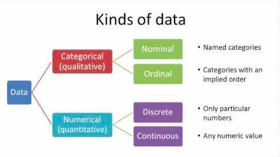

#  and others

> 자주 쓰는 code 또는 필요한 개념들. 잡다하게 있음

</br>

</br>

대부분의 model은 각 feature가(회귀에서는 target도) 정규분포와 비슷할 때 최고의 성능을 낸다. 확률적 요소를 가진 많은 알고리즘의 이론이 정규분포를 근간으로 하고 있기 때문이다. 그래서 전처리 과정에서 scaling 하기도 한다. (non-linear. ex- log, exp, squred….)

</br>

### 대회 초반에는 cv score가 leader board score와 어느정도 linear하게 움직이는지를 잘 살펴보면서 cv 시스템을 개선시킨다. 이 과정은 좋은 feature를 선별하는 목적이 가장 크다. lbs에 overfit되지 않게 주의

</br>

### Feature Importance

이 값은 0과 1사이의 숫자로, 각 feature에 대해 0은 전혀 사용되지 않았다는 뜻이며, 1은 완벽하게 target class를 예측했다는 뜻이다. 값이 낮다고 해서 이 특성이 유용하지 않다는 뜻은 아니다. 단지 트리가 그 특성을 선택하지 않았을 뿐이며 다른 특성이 동일한 정보를 지니고 있어서일 수 있다.

</br>

### 높은 확률로로 test, train validation score 나왔지만 비슷하다

둘의 score값이 비슷하다면, 높은 확률이어도 underfitting되었을 수 있다

</br>

### Boosting Algorithms

GBM, adaboost, XGboost, light GBM, catboost (순서)

XGboost는 categorical features를 따로 one-hot-encoding 해야 하지만, light BGM, catboost는 그럴 필요 없다

**catboost, lightGBM, XGboost 비교**

https://towardsdatascience.com/catboost-vs-light-gbm-vs-xgboost-5f93620723db

</br>

</br>

### Histogram, Distplot, Barplot, Countplot

**Histogram, Distplot은 coutinuous feature 일때**

* Histogram은 y축이 count

```python
# seaborn
# dist, kde 둘 다 null있으면 안된다
sns.distplot(train["target"], kde=False, bins=200)
sns.kdeplot(train["taget"])

# pyplot
# bins = 막대 개수
plt.hist(train["target"], bins=200)
# train["tageret"].hist(bins=200) 가능
plt.title('Histogram target counts')
plt.xlabel('Count')
plt.ylabel('Target')
plt.show()
```

* displot은 y축이 비율


**Barplot, Countplot은 categorical feature 일 때**

* Barplot은 y축 설정 해줘야 한다. 편차 표시 있음

* Barplot 가로, 세로 축 변경하면 수평되게 출력 가능

  ```python
  ax = sns.barplot(x='totalCount', y='name', data=df)
  ax.set_xlabel('totalCount')
  ```

* Countplot은 y축이 count

</br>

### factorplot과 pointplot의 차이

f는 hue describe가 그래프 밖

p는 hue describe가 그래프 안

f가 더 낫다

</br>

### warning message "ignore"일 경우, 없애기

```python
import warnings
warnings.filterwarnings("ignore")
```

</br>

### method 설명보기

```python
# helf(method), parameter 설명 상세하게 나온다
help(method)
```

</br>

### jupyter notebook에서 라이브러리내 method 확인하기

```python
# method??
mglearn.plots.plot_knn_classification??
```

</br>

### np.random

```python
# np.random.seed(x)
# seed를 사람이 수동으로 설정한다면 그 다음에 만들어지는 난수들은 예측할 수 있다.
# np.random.rand(x)
# 0부터 1사이의 균일 분포에서 x개 난수 생성
# np.random.shuffle(x)
# 배열 값 shuffle
np.random.seed(9)
np.random.rand(5)
# array([0.01037415, 0.50187459, 0.49577329, 0.13382953, 0.14211109])
np.random.rand(5)
# array([0.21855868, 0.41850818, 0.24810117, 0.08405965, 0.34549864])
np.random.seed(10)
np.random.rand(5)
# array([0.77132064, 0.02075195, 0.63364823, 0.74880388, 0.49850701])
np.random.seed(9)
np.random.rand(5)
# array([0.01037415, 0.50187459, 0.49577329, 0.13382953, 0.14211109])
```

</br>

### 그래프 모아서 보기

```python
# ncols 값이 1이면 아래 에러 난다
figure, axes = plt.subplots(nrows=1, ncols=2, figsize=(10, 18))
# plt.figure(figsize=(10, 7))
sns.barplot(data=train, x="year", y="total", ax=axex[0])
sns.barplot(data=train, x="month", y="total", ax=axex[1])
```

</br>

### 그래프 사이즈 정하기

```python
plt.figure(figsize=(10, 7))
```

</br>

### 전체 data에서 train, test data 분류

불균형 데이터셋을 각 클래스별 비율에 맞게 분류한다. StratifiedKFold와의 차이는 train_test_spilit의 경우 1회 시행하는데 반해 StratifiedKFold는 cv 횟수 만큼 train과 test를 분리 한다. 그리고 StratifiedShuffleSplit은 stratified하게 train과 test를 분리하지만, test에 선택된 인덱스가 cv마다 겹칠 수 있다

```python
# train_test_split 역시 default로 label값을 stratified하게 분류한다
X_train, X_test, y_train, y_test = train_test_split(iris_dataset["data"], iris_dataset["target"], random_state=0, test_size=0.2)
```

sklearn 내에 RepeatedKFold(회귀), REpeatedStratifiedKFold(분류) 있음. KFold를 교차 검증을 여러 번 적용하되 K개의 분할로 나누기 전에 매번 데이터를 무작위로 섞는 방법

</br>

### partial_fit()

전체 data를 메모리에 모두 적재할 수 없을 때난 fit() 메서드 대신에 학습된 것을 유지하면서 반복하여 학습할 수 있는 partial_fit() 메서드를 사용한다. 이는 mini-batch를 사용해 model을 점진적으로 학습시킨 경우와 유사하다

</br>

### reshape()

원소의 개수가 n개 일 때(차원은 중요하지 않다), 이를 원하는 shape으로 변형한다

reshape(-1, 1) : 열의 개수를 1로 유지하면서 행을 그에 맞게 변형한다 -> shape은 (n, 1)

reshape(1, -1) : 행의 개수를 1로 유지하면서 열을 그에 맞게 변형한다 -> shape은 (1, n)

reshape(-1) : 하나의 행렬로 존재한다 -> shape : (n, )

</br>

### Feature의 종류



**nominal**

ex) Sex - Male, Female

-> ont hot encoding, frequency encoding, mean encoding

카테고리 종류가 적으면 one hot encoding, 많으면 frequent, mean encoding을 쓰지만 더 좋은 점수를 만들기 위해서는 하나의 feature에 대해 one hot, frequency, mean 모두 사용하기도 한다

barplot

**ordinal**

ex) Height - Tall, Medium, Short

-> label encoding

**discrete**

ex) Age

**continuous**

Ex)Height, Weight

histogram, scatterplot, distplot

</br>

### subplot에서 그래프 불필요하게 더 나올 때 제거하기

```python
# 그래프 번호. 0부터 시작
plt.close(2)
```

</br>

### sns font scale

```python
sns.set(font_scale=4)
```

</br>

### voting : soft vs hard


</br>

### Error : variance + bias


</br>

### feature importance

일반적으로 RandomForest를 이용해서 확인한다. 많은 subset과 model을 이용하기 때문?

아님 여러 model을 사용해서 평균을 낼 수도 있다

</br>

### debug때는 data set 전부 읽을 필요 없다

**방법 1**

```python
DEBUG = True

if DEBUG:
	NROWS=10000
else:
	NROWS=None
```

```python
%%time
train = pd.read_csv("../input/train.csv", nrows=NROWS)
test = pd.read_csv("../input/test.csv", nrows=NROWS)
```

잘 되면 DEBUG 값만 False로 변경 후 전체 돌린다

```python
DEBUG = False
```

</br>

**방법 2**

```python
DEBUG = True

if DEBUG:
	FRAC=0.2
else:
	FRAC=None
```

```python
train = pd.read_csv("../input/train.csv")
train = pd.read_csv("../input/train.csv")
# local 환경에 맞게 비율 설정한다. random으로 추출
train = train.sample(frac=FRAC)
test = test.sample(frac=FRAC)
```

마찬가지로 잘 되면 DEBUG 값만 False로 변경 후 전체 돌린다

```python
DEBUG = False
```

</br>

**방법 3**

imbalanced data set의 경우, frac도 괜찮지만 더 정확하게 하고 싶다면

```python
from sklearn.model_selection import StratifiedKFold
```

```python
fold = StratifiedKFold(n_splits=10, random_state=666)
```

```python
# val_idx는 target idx말하는 것
for train_idx, val_idx in fold.split(train, train["target"]):
    # 딱 한번만 하겠다
	break
  
# train_test_split을 이용하면 StratifiedKFold에 반해 딱 한번만 나눔
X_train_1, X_test_1, y_train_1, y_test_1 = train_test_split(data_1[features], data_1["cancer_1"], random_state=random_state, test_size=0.2)
```

```python
train = train.loc[train_idx]
```

</br>

### How to sample Imbalanced DataSet

http://freesearch.pe.kr/archives/4506

https://datascienceschool.net/view-notebook/c1a8dad913f74811ae8eef5d3bedc0c3/

일반적으로 Oversampling이 Undersampling이 좋다고 한다.(?)

1. Oversampling

2. Undersampling

   ```python
   from imblearn.under_sampling import RandomUnderSampler
   
   # 수는 비율이 아니라 실제 수로 지정
   rus = RandomUnderSampler(random_state=11, ratio={1:cancer_num, 0:cancer_num*50})
   # 아래 코드 진행하면 numpy 배열로 return 되기 때문에 필요시 dataframe 형태로 변환
   X_resampled, y_resampled = rus.fit_resample(X_train, y_train)
   X_resampled_df = pd.DataFrame(data=X_resampled, columns=X_train.columns)
   y_resampled_df = pd.DataFrame(data=y_resampled, columns=['cancer'])
   ```

3. SMOTE, 일반적으로 재현율은 높아지나, 정밀도는 낮아진다


</br>

### Sampling

```python
# number로 sampling
df['num_legs'].sample(n=3, random_state=1)

# 비율로 sampling
df.sample(frac=0.5, replace=True, random_state=1)
```

</br>

### heatmap

Pearson Correlation Coefficient 값 나오는데, 이것만 맹신할 순 없다. 꼭 두 feature간의 시각화 해봐야 한다.

```python
sns.lmplot(x='ps_car_12', y='ps_car_14', data=s, hue='target', palette='Set1', scatter_kws={'alpha':0.3})
plt.show()
```


위와 같은 경우는 heatmap 결과 값이 0.67이 나왔지만, 시각화 결과 한 영역에 집중되어 있는 것을 확인할 수 있다. 이럴 때에는 그 선형성을 의심해야한다.

lmplot과 더불어 swarmplot있음. 더 보기 좋지만 시간 오래 걸림

lmplot은 FIgsize 변경 불가능 하다. 따라서 대신 regplot사용한다

</br>

### Feature 많을 때

https://scikit-learn.org/stable/modules/feature_selection.html

우선 위의 링크를 참조한다

추가적으로 팁은 1000개의 feature가 있을 경우, 1개씩 feature를 빼서 모델 성능을 확인하면 시간이 너무 오래 걸린다. 따라서 이럴 경우 block을 사용한다. block = 20으로 설정하면 총 1000/20 = 50번의 경우만 확인해보면 된다(위 링크에서 reculsive feature selection을 block화 시킨 방법)

**flow**

1. 20개 선정
2. 20개로 모델 학습 및 결과 산출
3. 20개 랜덤하게 선정해서 추가
4. 40개로 모델 학습 및 결과 산출
5. if 성능 향상되면
   1. feature importance 상위 10% 에 새로운 feature가 생겼는지 확인하고 있으면 그것을 남긴다
   2. 아니면 20개 다시 랜덤하게 선정해서 추가

6. 아니면 다시 랜덤하게 선정해서 추가

</br>

### early stopping

[Early stopping](https://en.wikipedia.org/wiki/Early_stopping) is an approach to training complex machine learning models to avoid overfitting

```python
xgb_model = xgb.train(params, d_train, nrounds, watchlist, early_stopping_rounds=100, 
                          feval=gini_xgb, maximize=True, verbose_eval=100)
```

nrounds 많큼 weak learner 만드는데, early_stopping_rounds 이후 성능 개선 되지 않으면 학습 멈춘다

</br>

### DMatrix

주로 넘파이 입력 파라미터를 받아서 만들어지는 XGboost만의 전용 데이터셋. 판다스의 dataFrame으로 데이터 인터페이스를 하기 위해서는 DataFrame.values를 이용해 넘파이로 일차 변환한 뒤에 이를 이용해 DMatrix 변환을 적용한다. 사용 이유는 메모리와 속도 향상. 파이썬 래퍼 사용시에는 DMatrix 사용한다. 사이킷런 래퍼는 사용 안해도 된다

```python
data_dmatrix = xgb.DMatrix(data=X,label=y)
```

</br>

### PCA와 FA(Factoro Analysis)의 차이

PCA는 선형 독립, FA는 그렇지 않다

PCA는 numerical data에 사용가능하지만, categorical data에는 넌센스다. 이럴 경우 FA를 진행한다

https://dogmas.tistory.com/entry/%EC%9D%B8%EC%9E%90%EB%B6%84%EC%84%9DFactor-analysis%EA%B3%BC-%EC%A3%BC%EC%84%B1%EB%B6%84%EB%B6%84%EC%84%9DPrincipal-component-analysis%EC%9D%98-%EC%B0%A8%EC%9D%B4%EC%99%80-%EB%B9%84%EC%8A%B7%ED%95%9C-%EC%A0%90-%EB%B9%84%EA%B5%90-SPSS-%EC%82%AC%EC%9A%A9%EC%84%A4%EB%AA%85%EC%84%9C-25

</br>

### correlation

pearson corr : 두 continuous 변수 사이의 상관 관계

spearman 상관 관계 : 두 continuous 또는 ordinal 변수 사이의 상관 관계. 이상점이 있거나 표본 크기가 작을 때 유용하다. Spearman 상관 계수는 원시 데이터가 아니라 각 변수에 대해 순위를 매긴 값을 기반으로 한다

</br>

### Stacking

https://medium.com/@gurucharan_33981/stacking-a-super-learning-technique-dbed06b1156d

</br>

### Data Leakage

원호님이 보내주신 [링크](https://www.kaggle.com/c/santander-customer-transaction-prediction/discussion/84614)에는 몇 가지 견해로 나오네요
첫째는 데이터에 대한 예상치 못한 info 유입
ex) Training data의 ordering이 예상치 못하게 target과 연관이 있음
사진 데이터, 사진을 찍으면 사진파일에 헤더로 사진을 찍은 정보가 나오기도 함
그런데, 이 첫째는 예측에 도움을 줄 수 있기 때문에 leak이긴 하나  good leak라고 하네요.

둘째는, Target Variable이 feature engineering 과정에서 적절하지 못하게 유입이 되는 경우
ex) Target encoding 과정에서 잘못하다가 새로운 feature로 target info가 누출될 수 있다고 합니다.

세번째는, A real machine learning problem, 그 feature가 실제로 사용이 가능할까?
ex) 고객이 물건을 살지 사지 않을지를 예측해야 하는데, 여러가지 feature(나이, 성별, 물건 가격, 등등)를 사용할 수 있습니다. 그런데 만약 '고객센터 전화시간'을 feature로 만들면 예측하는데는 아주 유용하게 쓸수는 있습니다만, 고객센터에 전화를 할지 말지는, 물건을 산 다음에 이루어지는 것이므로, 예측 후에 일어나는 사안에 관한 feature는 사용하지 않아야 한다.
-> 이건 약간 실제로 현업에서 데이터셋을 가지고 모델을 만들어야 하는 경우에 조심해야할것 같습니다.

종수님이 보내주신 링크는 아마 2번째와 연관이 있거나 비슷한 내용 같습니다.

https://ishuca.tistory.com/419

</br>

### 수행 시간 측정

```python
import time
start_time = time.time()
# ...
print("수행시간 : {%.1f}초".format(time.time() - start_time))
```

</br>

### get_clf_eval(y_test, predict)

accuracy, 정밀도, 재현율, F1, AUC 값 한 번에 나타낸다

</br>

### 부스팅 알고리즘 하이퍼파라미터 튜닝

Learning_rate를 작게 하면서 n_estimators를 크게 하는 것은 부스팅 계열 튜닝에서 가장 기본적인 튜닝 방안이다

</br>

### 일반적인 하이퍼파라미터 튜닝

2~3개 정도의 파라미터를 결합해 최적 파라미터를 찾아낸 뒤에 순차적으로 이 최적 파라미터를 기반으로 다시 1~2개 정도의 파라미터를 결합해 튜닝

</br>

### hyperparemeters tuning, optimization

* grid search

* random search, coarse to fine search

* bayesian optimization

  * 두 가지 라이브러리 있다

    ```python
    from bayes_opt import BayesianOptimization
    from skopt import BayesSearchCV
    ```
    
  * http://research.sualab.com/introduction/practice/2019/02/19/bayesian-optimization-overview-1.html

</br>

### 소수점 자릿수

```python
# 39.54484700000000 -> 39.54
print("{:.2f}".format(39.54484700000000))
```

</br>

### 다중공선성

피쳐간의 상관관계가 매우 높은 경우 분산이 매우 커져서 오류에 매우 민감해진다

</br>

### regplot

산점도와 함께 선형 회귀 직선을 그림

```python
sns.regplot(x=feature, y='PRICE', data=bostonDF, ax=axs[row][col])
```

</br>

### 다항 회귀

회귀가 독립 변수의 단항식이 아닌 2차, 3차 방정식과 같은 다항식으로 표현되는 것을 다항 회귀라고 한다. 다항 회귀는 선형 회귀다. 회귀에서 선형/비선형 회귀를 나누는 기준은 회귀 계수가 선형/비선형인지에 따른 것이지 독립 변수의 선형/비선형 여부와는 무관하다. 사이킷런에서는 다항 회귀를 위한 클래스를 따로 마련해두지 않았기 때문에 PolynomialFeatures()로 feature를 변형하고, 이를 LinearRegression 클래스로 다항 회귀 구현한다. degree가 높을 수록 overfitting 위험성 높다. 일반적으로 차수는 2를 넘기지 않는다. 다항식 변환은 히처의 개수가 많을 경우 적용하기 힘들며, 또한 데이터 건수가 많아지면 계산에 많은 시간이 소모되어 적용에 한계가 있다

</br>

### 로그 변환

일반적으로 log() 함수를 적용하면 언더 플로우가 발생하기 쉬워서 1 + log() 함수를 적용하는데 이를 구현한 것이 np.log1p()

* under flow : 메모리가 표현할 수 있는 수 보다 작은 수를 저장하는 경우

```python
np.log1p()
```

log1p()로 변환된 값을 다시 원래 상태로 복구

```python
np.expm1()
```

</br>

### 회귀 트리 regressor는 feature importance를, 선형 회귀는 coef_ 회귀 계수를 확인

아래는 classifier로 feature importance 확인하는 경우

Tree 모델의 경우 feature importance를 뽑는 방식은 feature하나를 제외 시켰을 때와 포함시켰을 때 metric의 차이를 이용해 importance를 산정한다

https://scikit-learn.org/stable/auto_examples/ensemble/plot_gradient_boosting_regression.html

```python
feature_importance = clf.feature_importances_
# make importances relative to max importance
feature_importance = 100.0 * (feature_importance / feature_importance.max())
sorted_idx = np.argsort(feature_importance)
pos = np.arange(sorted_idx.shape[0]) + .5
plt.subplot(1, 2, 2)
plt.barh(pos, feature_importance[sorted_idx], align='center')
plt.yticks(pos, X_train.feature_names[sorted_idx])
plt.xlabel('Relative Importance')
plt.title('Variable Importance')
plt.show()
```

```python
# 모델 여러 개 또는 seed number 여러개 사용할 경우
n = 10
importance_list = []
for i in range(n):
  model = RandomForestClassifier(random_state=i, max_depth=4)
  model.fit(X_train, y_train)
  importance = model.feature_importances_
	importance = 100.0 * (importance / importance.max())
  importance_list.append(importance)
importance_arr = np.array(importance_list)
importance_sum = importance_arr.sum(axis=0)
importance_mean = importance_sum / n
sorted_idx = np.argsort(feature_importance)
pos = np.arange(sorted_idx.shape[0]) + .5
plt.subplot(1, 2, 2)
plt.barh(pos, importance_mean[sorted_idx], align='center')
plt.yticks(pos, X_train.columns[sorted_idx])
plt.xlabel('Relative Importance')
plt.title('Variable Importance')
plt.show()
```

</br>

### 모델 이름 파악

```python
# model._class_.name를 사용하는 예시

models = [lr_reg, ridge_reg, lasso_reg]

def get_rmse(model):
	pred = model.predict(X_test)
	mse = mean_squared_error(y_test, pred)
	rmse = np.sqrt(mse)
	print(model._class_.name, ' 로그 변환된 RMSE : ', np.round(rmse, 3))
	return rmse
	
get_rmses(models):
	rmses=[]
	for model in models:
		rmse = get_rmse(model)
		rmses.append(rmse)
	return rmses

```

</br>

### skew()

일반적으로 skew() 함수의 반환 값이 1 이상인 경우를 왜곡 정도가 높다고 판단한다. 하지만, 상황에 따라 편차는 있다. 1이상의 값을 반환하는 feature만 추출해 왜곡 정도를 완화하기 위해 변환(ex- log)을 적용한다. 이 때 주의할 점은 모든 숫자형 feature에 적용하는 것이 아니라는 점이다. one-hot-encoding된 카테고리 숫자형 feature는 제외한다

* 파이썬 머신러닝 완벽 가이드 p.361 참조

```python
from scipy.stats import skew

# object가 아닌 숫자형 피처의 컬럼 index 객체 추출
features_index = house_df.dtypes[house_df.dtypes != object].index
# int, float, object로 분류 할 수 있다

# house_df에 컬럼 index를 []로 입력하면 해당하는 컬럼 데이터 세트 반환.
skew_features = house_df[features_index].apply(lambda x: skew(x))
# skew 정도가 1이상인 컬럼만 추출
skew_features_top = skew_features[skew_features > 1]
print(skew_features_top.sort_values(ascending=False))
                                 
# log변환(항상 log 변환은 아닐 수 있다)                                 
house_df[skew_features_top.index] = np.log1p(house_df[skew_features_top.index])                                 
```

</br>

### list 원소 unique하게 변경

```python
my_set = set(my_list)
my_list = list(my_set)
```

</br>

### (list a) - (list b) 없다. (set a) - (set b) 있다

</br>

### cheatsheet

https://github.com/abhat222/Data-Science--Cheat-Sheet

</br>

### 셀 안에서 여러 줄 있으면 에러난 줄 전까지는 실행 됨

</br>

### numpy 단순 함수

```python
# 2부터 9까지로 구성된 ndarray 생성
np.arange(2, 10)

# (3, 2) shape의 0으로 구성된 ndarray 생성, dtype 설정하지 않으면 default는 float64
np.zeros((3, 2), dtype='int32')
np.ones((3, 2))

# array를 해당 shape에 맞게 변형, 불가능한 경우 에러 발생. ex) (10, ) -> (3, 4) 불가능
# -1 인자로 주면 지정된 column 또는 row에 맞게 저절로 변형. 정확히 이야기하면 row는 axis=0, columns은 axis=1
array1.reshape(2, 3)
array1.reshape(-1, 5)
# 여러개의 row를 가지되, column은 한개. 아래 함수 자주 사용
array1.reshape(-1, 1)

# sort, 오름차순
np.sort(array1)
# sort, 내림차순
np.sort(array1)[::-1]
# sort, 다차원일 경우 특별 축으로 정렬
np.sort(array1, axis=1)
# sort, 위의 sort는 return한 행렬이 정렬될 뿐 원행렬은 변경되지 않음. 아래는 변경되지만 reutnr 값이 없음
array1.sort()
# 행렬 정렬 시 원본 행렬의 인덱스 행렬로 반환
np.argsort(array1)
# 행렬 내림차순 정렬 시 원본 행렬의 인덱스 행렬로 반환
np.argsort(array1)[::-1]

# 행렬 내적
A = np.array([[1, 2, 3], [4, 5, 6]])
B = np.array([[7, 8], [9, 10], [11, 12]])
dot_product = np.dot(A, B)

# 전치 행렬
A = np.array([[1, 2], [3, 4]])
transpose_mat = np.transpose(A)
```

</br>

### covariate : 공변량

공변량이라는 변수는 독립변수라기 보다는 하나의 개념으로서 여러 변수들이 공통적으로 함께 공유하고 있는 변량을 의미한다. 어떤 연구를 하고자 할 때의 주요 목적은 연구하고자 하는 독립변수들이 종속변수에 얼마나 영향을 주는지 알고자 하는 것이다. 그러나 잡음인자가 있을 경우 독립 변수의 순수한 영향력을 검출해 낼 수 없으므로 통계적 방법을 이용해 잡음 인자를 통제하는데, 그 방법중 하나가 공변량이다

</br>

### censored data

> 생존분석

* right censored data

  관찰 기간 동안 event 발생하지 않아 언제 event가 발생할지 알 수 없음

  ex) 암 환자가 관찰 기간 동안 사망하지 않음

* interval censored data

  Event 발생 시점은 정확히 모르나 관찰 기간 중 발생했다는 것은 알고 있음

  ex) 암 환자가 관찰 기간 동안 사망했으나 구체적 시점 모름

* left censored data

  시작 시점이 정확히 언제부터 인지 알 수 없음

  ex) 관찰 기간 중 사망한 유방암 환자가 언제부터 유방암 있었는지 알 수 없음

</br>

### make_classification

분류용 가상 데이터 생성

https://datascienceschool.net/view-notebook/ec26c797cec646e295d737c522733b15/

</br>

### Model 저장하기

model의 weight를 문서화해 저장하고, 이후에 이를 바로 이용한다

```python
model.save_weights('./model.h5')
```

</br>

### knn 결측 처리

```python
from fancyimpute import KNN


train = KNN(k=n).fit_transform(train)
test = KNN
```

</br>

### keras에서 roc-auc 사용하기

https://stackoverflow.com/questions/41032551/how-to-compute-receiving-operating-characteristic-roc-and-auc-in-keras

</br>

### pyecharts

시각화 라이브러리

```
import pyecharts
```

참조

https://zzsza.github.io/development/2018/08/24/data-visualization-in-python/