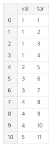
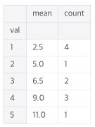

#  Dataframe 처리

</br>

### Check data set

```python
# count, mean, std, min, max, 25%, 50%, 75%
# 숫자형 데이터(int, float)만 표기
train.describe()

# null개수, dtype(dtype은 한 열에 여러개 섞여 있어도 다 나타내지 않고 가장 넓은 타입 하나만 나타낸다. None은 float)
train.info()

# 전체 feature의 type
train.dtypes.value_counts()
```

</br>

### null을 입력하고 싶을 때는 None을 입력한다

</br>

### DataSet이 크다?

sample이 크거나, feature가 많다

feature가 3개면 3차원 dataSet

</br>

### dataframe에서 한 컬럼만 부르면 그것의 type은 series

</br>

### series -> dataframe

```python
df = trn_series.to_frame(trn_series.name)
```

</br>

### 배열 -> series

```python
coeff = pd.Series(data=np.round(lr.coef_, 1), index=X_data.columns)
```

</br>

### 임의 데이터 프레임 만들기

```python
# 방법 1
df = pd.DataFrame([["11","2", "6"], ["12","4", "2"], ["13","3", "4"]], columns=["a","b", "c"])

pd.DataFrame(data=np.array([[1, 2, 3], [4, 5, 6], [7, 8, 9]]), index= [2, 'A', 4], columns=[48, 49, 50])

# 방법 2
df = pd.DataFrame({
          'A':['a','b','a'],
          'B':['b','a','c']
        })
```

</br>

### Index column 설정

```python
# 방법 1
train = pd.read_csv("./train.csv", index_col="PassengerId")

# 방법 2
# ()안에 inplace = True, 설정하면 train = 없어도 된다
train = train.set_index("col_name")
```

</br>

### 특정 column "Y"->1, "N"->0 으로 변경

```python
df["col_name"] = df["col_name"].map({'Y':1, 'N':0})
```

</br>

### column 이름 변경

```python
df.rename(columns={"a" : "c", "b" : "d"}, inplace=True)
```

</br>

### dataFrame, 컬럼 기준으로 정렬하기

```python
# reset_index 고려 해줘야한다
count_list = count_list.sort_values(by="a", ascending=False)
```

</br>

### null값 채우기

https://pandas.pydata.org/pandas-docs/stable/reference/api/pandas.DataFrame.fillna.html

```python
train["Age"].fillna(0, inplace=True)

# 각 컬럼 별로 mean 구해서 null을 mean으로 채움
train.fillna(train.mean(), inplace=True)

# 앞의 값으로 채움
df.fillna(method='ffill')

# 뒤의 값으로 채움
df.fillna(method='bfill')

# 일부 컬럼만 채울 경우
df.fillna(df[col_list].mean())

# dictionary 활용
# a, b, c는 컬럼명
new_data = {'a' : 1, 'b' : 0, 'c' : -1}
df.fillna(new_data)
# 각 컬럼에서 2번째 None까지만 채우기
df.fillna(new_data, limit=2)

# default, axis=0, 열 기준 이전 데이터. ffill은 inplace=True 안된다? 문서에는 잇는데...?
df.ffill(axis=0)

# 행 기준 이전 데이터
df.ffill(axis=1)

# 동일 id끼리만 ffill 적용(특정 컬럼에 대해 적용)
df['val'] = df.groupby('id')['val'].ffill()

# 전체 컬럼에 대해 적용, 여기서 features는 pid를 제외하고 선택한 컬럼
df[features] = df.groupby('pid').ffill()

# bfill도 ffill과 마찬가지
```

</br>

### 컬럼 지우기

```python
del train["col_name"]
```

</br>

### list -> dataFrame

```python
count_list = pd.DataFrame.from_dict(count_list)
```

</br>

### dataFrame에 index 입력하기

```python
count_list.index.name = "store_id"
```

</br>

### 시계열 data 읽어오면서 date 인식. 연도, 월, 날짜, 시간, 분, 초 컬럼 생성

```python
# 방법 1
train = pd.read_csv("data/bike/test.csv", parse_dates=["datetime"])

# 방법 2
train['first_active_month'] = pd.to_datetime(train['first_active_month'])

train["datetime-year"] = train["datetime"].dt.year
train["datetime-month"] = train["datetime"].dt.month
train["datetime-day"] = train["datetime"].dt.day
train["datetime-hour"] = train["datetime"].dt.hour
train["datetime-minute"] = train["datetime"].dt.minute
train["datetime-second"] = train["datetime"].dt.second

# or
trian['datetime-year'] = train['datetime'].apply(lambda x: x.year)
```

**datetime은 비교 가능하다 <, >, ==**

https://inma.tistory.com/96

</br>

### 백분위 수를 이용해 data 찾기

```python
# 50%에 위치하는 data, 중앙값
np.percentile(train["col_name"], 50)
```

<br>

### Lambda 에서 elif 사용하고 싶을 때, else 여러번

row 별로 적용할 때는?

```python
train["Pclass"] = train["Pclass"].apply(lambda x: "A" if x == 1 else ("B" if x == 2 else "C"))
```

</br>

### lambda 에서  여러개 컬럼 사용하고 싶을 때

```python
# 보통 하나의 컬럼만 인자로 뽑아서 사용할 때는 X_mammo['column'].apply(lambda x : )를 진행하지만, 여러개 컬럼 이용할 때는 X_mammo만 적용한다. 하나의 로우를 다 인자로 사용하는 것. 이 때 axis=1 잊지 말기
X_mammo['target'] = X_mammo.apply(lambda x : find_year_after_last(x.id, x.YYYY, df_target), axis=1)
```

</br>

### one-hot-encoding 한번에

```python
# 특정 column만
train = pd.get_dummies(historical_transactions, columns=['category_2', 'category_3'])

# 범주형 컬럼 중 값이 문자열로 되어진 것만 전부 바꿔준다. 값이 숫자로 되어 있는 범주형 컬럼은 위와 같이 컬럼명을 따로 명시해줘야하거나, 그 값을 str으로 변환한 후 get_dummies()함수를 사용해야 한다
train = pd.get_dummies(train)
```

</br>

### 시계열 data를 split해서 연도, 월, 날짜 관련 컬럼을 생성

```python
def split_date(date):
    try: return date.split("-")
    except: return (None, None, None)
```

```python
train["year"], train["month"], train["day"] = zip(*train['date'].apply(lambda x: split_date(x)))

# zip([1, 1, 1], [2, 4, 8], [3, 9, 27]) -> (1, 2, 3), (1, 4, 9), (1, 8, 27)
# zip(*[[1, 2, 3], [2, 3, 4], [3, 4, 5]]) -> (1, 2, 3), (1, 4, 9), (1, 8, 27)
# *은 unpack을 의미한다
# .apply(lambda x : 함수)
```

</br>

### string 형태의 숫자를 int로 바꿀 때

```python
# train["year"] = int(train["year"])로 하면 안된다
# error message : cannot convert the series to <class 'int'>

train["year"] = train["year"].astype(int)

# error는 NA 처리
pd.to_numeric(df['BL2011'], errors='coerce')
```

</br>

### train["column"] 값 array로 만들기

```python
my_array = train["column"].values
```

</br>

### array 내에 중복되는 값 없애기

```python
# list에는 .unique() 함수 없다
# 아래 처럼 하면 값 순서대로 정렬되서 나온다
uniqueVals = np.unique(my_array)

# 바로 컬럼에 적용해서 사용할 수도 있다
train["column"].unique()
```

</br>

### array -> list

```python
my_list = uniqueVals.tolist()
```

</br>

### case : "nextday_date"컬럼 값이 holiday_date_list에 포함 되어 있는 경우 "nextday_holiday"를 1로 채워넣기

```python
# 방법 1
idx = [idx for idx, value in enumerate(train["nextday_date"]) if value in holiday_date_list]

# enumerate는 순서가 있는 자료형(리스트, 튜플, 문자열)을 입력으로 받아 인덱스 값을 포함하는 enumerate 객체를 리턴한다
# idx 리스트는 결국 해당 조건이 맞는 경우의 idx들의 모음 의미한다

train.loc[idx, "nextday_holiday"] = 1
```

```python
# 방법 2
train.loc[train["nextday_date"].isin(holiday_date_list), "nextday_holiday"] = 1
train.loc[train["nextday_holiday"].isnull(), "nextday_holiday"] = 0

# 방법 3
train["nextday_holiday"] = train["nextday_date"].isin(holiday_date_list).astype(int)

###############
# 방법 4, 가장 좋다
train["nextday_holiday"] = train["nextday_date"].apply(lambda x : 1 if x in holiday_date_list else 0)
```

</br>

### "Name" 컬럼 내 해당 문자열 존재하는 경우, "Title" 컬럼을 "Mr"로 채워 두기

```python
train.loc[train["Name"].str.contains("Mr"), "Title"] = "Mr"
```

</br>

### 이 때문에 이번 column내 문자열 변경

```python
train["Name"] = train["Name"].str.replace("Mr", "아저씨")

# 전체 컬럼
train.replace('.', np.nan, inplace=True)
train.replace('.', None, )

# dictionary로 사용하면 변경 가능
df.replace({'-': None})

train['Initial'].replace(['Mlle','Mme','Ms','Dr','Major','Lady','Countess','Jonkheer','Col','Rev','Capt','Sir','Don'],['Miss','Miss','Miss','Mr','Mr','Mrs','Mrs','Other','Other','Other','Mr','Mr','M
                                                                                                                       
```

</br>

### 컬럼에서 숫자만 추출할 경우

```python
# 컬럼 값이 문자와 숫자로 혼합되어 있는 경우 통일 필요할 때
# "(\d+)" 정규표현식 사용
# ex) 31세, 31 세, 31 -> 31로 통일, NaN -> 0

################
# 방법 1, 가장 좋다
train.loc[train["Age"].isnull(), "Age"] = 0
# 미리 str으로 전부 바꿔줘야한다. 아주 중요 !
train["Age"] = train["Age"].astype(str)
train["Age"] = train["Age"].str.extract("(\d+)").astype(int)

# 방법 2
train.loc[train["Age"].isnull(), "Age"] = "0"
train.loc[train["Age"].str.contains(" 세"), "Age"] = train["Age"].str.replace(" 세", "")
train.loc[train["Age"].str.contains("세"), "Age"] = train["Age"].str.replace("세", "")
train["train"] = train.["Age"].astype(float)
train["train"] = train.["Age"].astype(int)


# 방법 3
# 22.0은 220으로 바뀐다는 점 주의. 정수 표현일 때 사용
# 1과의 차이는 1의 경우 앞의 숫자만 나옴. 예를 들어 7,000,000 이 str으로 저장되어 있을 경우 7만 추출
# 3의 경우, 7000000 모두 추출
train['Age'].replace(regex=True,inplace=True,to_replace=r'\D',value=r'')
```

</br>

### 컬럼 중 max, min, mean

```python
train["Age"].max()
train["Age"].min()
train["Age"].mean()
```

</br>

### python, lambda

https://wikidocs.net/64 참고

map(), reduce(), filter()에 어떻게 적용하는지

</br>

### groupby()

그룹별 통계

https://datascienceschool.net/view-notebook/76dcd63bba2c4959af15bec41b197e7c/

아주 잘 설명되어 있다

```python
# 각 컬럼별로 max, min 구한다
train.groupby('Pclass')[['PassengerId', 'Survived']].agg(['max', 'min'])

# 각 컬럼별로 서로 다른 aggregation 적용할 경우
agg_format = {'Age':'max', 'SibSp':'sum', 'Fare':'mean'}
train.groupby('Pclass').agg(agg_format)
```

**aggregation의 종류**

- `size`, `count`: 그룹 데이터의 갯수
- `mean`, `median`, `min`, `max`: 그룹 데이터의 평균, 중앙값, 최소, 최대
- `sum`, `prod`, `std`, `var`, `quantile` : 그룹 데이터의 합계, 곱, 표준편차, 분산, 사분위수
- `first`, `last`: 그룹 데이터 중 가장 첫번째 데이터와 가장 나중 데이터

</br>

### index 없애서 일반 colum으로 변경

```python
# drop 설정하면 기존의 index는 새로운 컬럼으로 추가되지 않고 삭제된다
train.reset_index(drop=True, inplace=True)
```

</br>

### index 설정

```python
train.set_index('col_name', inplace=True)
```

</br>

### 범주형 데이터 값과 해당 개수 확인하기

```python
# Series 객체에 적용하는 method
train["column"].value_counts()
```

</br>

### column indexing

```python
# numpy는 마지막 원소를 포함하지 않지만, pandas는 포함한다
# a컬럼에서 b컬럼까지
X_train = train.loc[:, "a":"b"]
```

</br>

### 구간분할(binding, 이산화)

```python
# -3부터 3까지 11개의 point로 분할. 구간은 10
bins = np.linspace(-3, 3, 11)

# X를 각 구간에 맞게 1~10으로 표시
which_bin = np.digitize(X, bins=bins)
```

</br>

### crossTab

```python
pd.crosstab([train["Sex"], train["Survived"]], train["Pclass"], margins=True).style.background_gradient(cmap='summer_r')
```

</br>

### pandas.qcut()

```python
# 샘플 수를 비슷하게 맞춰준다
train["Fare_Range"] = pd.qcut(train["Fare"], 4)
```

</br>

### pandas.cut()

```python
# range를 일정하게 해서 4등분
train["Fare_Range"] = pd.qcut(train["Fare"], 4)
```

</br>

### drop()

```python
# column drop
train.drop(columns=["Name", "Age", "Ticket", "Fare", "Cabin", "Fare_Range", "PassengerId"], axis=1, inplace=True)

# row drop, labels는 index의미
# row 삭제할 때는 reset_index 해줘야 한다. 삭제된 index 건너 뛰고 index 표기됨
train.drop(labels=[0, 3, 4], axis=0, inplace=True)
```

</br>

### categorical 컬럼 값 몇 종류 있는지 확인

```python
col_list = categorical 컬럼 리스트
for col in col_list:
	print(train[col].nunique())
```

</br>

### 중복된 row 없애기

```python
train.drop_duplicates()
```

</br>

### assert

```python
# assert 이후가 맞으면 넘어가고, 틀리면 error 발생
assert len(trn_series) == len(target)
```

</br>

### imputer

```python
# null data 처리
from sklearn.preprocessing import Imputer
```

```python
# Imputing with the mean or mode
# missing_values에 none 입력 불가
mean_imp = Imputer(missing_values=-1, strategy='mean', axis=0)
mode_imp = Imputer(missing_values=-1, strategy='most_frequent', axis=0)
```

```python
# ravel()은 shape 변경해주는 것 (8000, 1) -> (8000,), reshape(-1)과 비슷하다고 보면 된다
train['ps_reg_03'] = mean_imp.fit_transform(train[['ps_reg_03']]).ravel()
train['ps_car_11'] = mode_imp.fit_transform(train[['ps_car_11']]).ravel()
```

</br>

### LabelEncoder()

```python
# String -> 숫자로 변경
from sklearn.preprocessing import LabelEncoder

for col in ["Sex", "Embarked", "Initial"]:
    train[col] = LabelEncoder.fit_transform(train[col])
```

```python
# factorize도 label encoding 하는 것. label encoder보다 빠르다
indexer = {}

for col in ["Sex", "Embarked", "Initial"]:
    _, indexer[col] = pd.factorize(train[col])
    train[col] = indexer[col].get_indexer(train[col])
```

</br>

### mean encoding

특정 컬럼의 각 속성값과 대응하는 타겟값의 곱을 전부 더한 뒤 속성값과 그 속성값의 개수를 곱해 나눠준다

**ex)**

 ————> 


overfitting 일어날 가능성 높다. 이를 막기 위해 noise를 추가하기도 한다(descrete한 걸 부드럽게 바꿔줌). 일종의 Regularization

참조 링크

https://medium.com/datadriveninvestor/improve-your-classification-models-using-mean-target-encoding-a3d573df31e8

https://www.kaggle.com/vprokopev/mean-likelihood-encodings-a-comprehensive-study

</br>

### fequency encoding

https://www.kaggle.com/youhanlee/which-encoding-is-good-for-time-validation-1-4417

```python
def frequency_encoding(frame, col):
    # 각 클래스를 index로 하여 클래스별로 몇 개 씩 있는지
    freq_encoding = frame.groupby([col]).size()/frame.shape[0] 
    # 위의 것에서 index를 없애고 개수가 있는 컬럼 이름(0)을 변경
    freq_encoding = freq_encoding.reset_index().rename(columns={0:'{}_Frequency'.format(col)})
    return frame.merge(freq_encoding, on=col, how='left')
```

</br>

### rank encoding

```python
df = pd.DataFrame({'A' : [1, 2, 1, None, 1, 6, 1, 1, 1],
                   'B' : [0.1, 0.2, 0.6, 0.6, 1.5, 9.1, 0.5, 0.10, 0.6]})

# na_option은 None을 rank의 가장 위 또는 아래로 두는 것. keep은 None으로 그대로 둔다
df['A_ranked'] = df['A'].rank(ascending=1, method='min', na_option='top')
```

</br>

### 계층이 여러개인 컬럼에서 sort_values() 적용

```python
# ["1번 계층 컬럼", "2번 계층 컬럼"]
# 오름차순
cat_perc.sort_values(by=["target", "mean"], ascending=False, inplace=True)
```

 —————> 

</br>

### 두 개의 데이터 프레임을 합칠 때

https://datascienceschool.net/view-notebook/7002e92653434bc88c8c026c3449d27b/

#### merge

두 데이터 프레임의 공통 열 혹은 인덱스를 기준으로 두 테이블을 합친다.  이 때 기준이 되는 열, 행의 데이터를 키(key)라고 한다

key를 multi로 할 경우

```python
pd.merge(df_1, df_2, on=['key1', 'key2'])
```

```python
# df_1에는 id 중복되어 있고, df_2에는 id unique할 때
# left에 있는 데이터는 그대로 
pd.merge(df_1, df_2, on=['id'], how='left')
```

#### concat

key를 사용하지 않고 단순히 데이터를 세로 또는 가로 방식으로 연결한다. **따라서 인덱스 값이 중복될 수 있다**.

```python
# 행으로(아래로) 붙이는 방식은 axis=0, default
df = pd.concat([df_1, df_2])
# 중복된 인덱스 없애기. 예를 들어 df_1이 0, 1, 2, 3 인덱스 있고, df_2가 0, 1, 2 있으면 df의 인덱스는 0, 1, 2, 3, 0, 1, 2 이런식으로 생성되어 버림
df.reset_index(inplace=True)

# 열로(옆으로) 붙이는 방식은 axis=1
df = pd.concat([df_1, df_2], axis=1)
```

</br>

### append

concat과 동일한 기능. 마찬가지로 인덱스 값이 중복될 수 있기 때문에 reset_index 필요하다

```python
df = df.append(df1)
df.reset_index(inplace=True)
df.drop('index', axis=1, inplace=True)
```

</br>

### string 일치는 == 으로, dataframe 일치는 df_1.equals(df_2)

</br>

### groupby 좀 잘쓰자...

**상황**

dataframe에 id컬럼이 있고, id값은 중복되는 경우가 있다. 그리고 year 컬럼이 있다. 여기서 각 id마다 year가 무엇 무엇이 있는지 확인하고자 한다

```python
df_val = df.groupby('id')['year'].unique().to_frame()
df_val.reset_index(inplace=True)
```

만약 개수를 확인하고 싶다면

```python
df_val = df.groupby('id')['year'].nunique().to_frame()
df_val.reset_index(inplace=True)

# df_val = df.groupby('id').count() 하면 각 컬럼별 count 뽑을 수 있음. to_frame()도 필요 없다
df_val = df.groupby('id')['year'].count().to_frame()
df_val.reset_index(inplace=True)

# frequency_encoding도 있다
```

이렇게 볼 수도 있다

```python
pd.DataFrame({'count' : meta.groupby(['role', 'level'])['role'].size()})
```

</br>

### c for c in

```python
temp_list = [c for c in a_list if ('density' in c or 'caregory' in c)]
```

</br>

### dataframe to dictionary

id가 중복되는 경우 없을 때

```python
a = pd.DataFrame({'id' : [1, 1, 3, 5, 4],
									'YYYY' : [2001, 2002, 2003, 2004, 2004]})
a_dict = a.set_index('id')['YYYY'].to_dict()

# 결과물
# 중복되는 것 중 마지막 것만 입력됨
#{1: 2002, 3: 2003, 5: 2004, 4: 2004}
```

id가 중복되는 경우 있을 때

```python
a = pd.DaraFrame({'id' : [1, 1, 3, 5, 4],
									'YYYY' : [2001, 2002, 2003, 2004, 2004]})

a_dict = {id_: yyyy['YYYY'].tolist() for id_, yyyy i ttt.groupby('id')}
# 결과물
# 중복되는 것 중 마지막 것만 입력됨
# {1: [2001, 2002], 3: [2003], 5: [2004], 4: [2004]}
```

</br>

### col로 sort

```python
ttt.sort_values(by=['id', 'YYYY'])
# index 순서로 sort
ttt.sort_index()
```

</br>

### column type 확인

```python
if mammo[col].dtypes == np.int64
if mammo[col].dtypes == np.float64
# 둘 다 아니면 object
```

</br>

### 문자열 있는지 확인

```python
mysite = 'Site name is webisfree.'
if 'webisfree' in myname:
  print('Okay')
```

</br>

### 데이터 프레임 동일한지 비교

```python
df1.equals(df2)
```

</br>

### 데이터 복사

```python
house_df_org = pd.read_csv('./house_price.csv')
# 그냥 house_df = house_df_org 할 경우, 둘 중 하나 변하면 다른 것도 변
house_df = house_df_org.copy()
```

</br>

### 모든 컬럼에서 null 확인

```python
df.isnull().sum()
print(isnull_series[isnull_series > 0].sort_values(ascending=False))

# 특정 컬럼만 확인
isnull_series = df[col].isnull().sum()
```

</br>

### dataframe 행 변경 및 추가

```python
# 행
df.loc[index번호] = [1, 2, 3]

# 열
df['A'] = [10, 20, 30]
```

</br>

### nan은 isnull()로 잡힌다. NaN, None은 isnull()로 안잡힌다?

### nan, NaN, None의 타입은 각각 str, float, NoneType…nan이 numpy.float64로 나오는 경우도 있다…math.isnan(a)으로 잡힐 수도 있으니 확인. 다시 정리

```python
# dataframe내의 row 돌면서 string 확인할 때, math.isnan(a)으로 확인
if type(input_) != str:
	if math.isnan(input_):
		continue
```

</br>

### row별 각 컬럼값의 합, 최소값...을 sum이라는 컬럼에 넣음

```python
df['sum'] = df[numerical_fs].sum(axis=1)  
```

</br>

### 최빈값 찾기

```python
from collections import Counter

# n 개수만큼 가장 많은 순서대로 뽑는다. .head(n)처럼
Counter(df['A']).most_common(n)

# value 뽑기
df['A'].value_counts()

# 가장 많은 value 뽑기
df['A'].value_counts().idxmax()
```

</br>

### 날짜 차이 구하기

```python
from datetime import datetime

# datetime.strptime(date, '%Y-%m-%d')끼리는 비교가 가능하다
def get_diff_days(real_date, standard_date):
	try: return(datetime.strptime(real_date, "%Y-%m-%d") - datetime.strptime(standar_date, "%Y-%m-%d")).days
	except: return None
```

</br>

### Series와 DataFrame의 차이

Series는 컬럼이 하나뿐인 데이터 구조체, DataFrame은 컬럼이 여러 개인 데이터 구조체

</br>

### DataFrame과 list, dictionary, 넘파이 ndarray 상호 변환 가능

```python 
import numpy as np

col_name = ['col1', 'col2', 'col3']
list1 = [[1, 2, 3], [11, 12, 13]]
array1 = np.array(list1)
dict1 = {'col1' : [1, 11], 'col2' : [2, 22], 'col3' : [3, 33]}
# 리스트를 이용해 DataFrame 생성
df_list1 = pd.DataFrame(list1, columns=col_name)
# 넘파이 ndarray를 이용해 DataFrame 생성
df_array1 = pd.DataFrame(array1, columns=col_name)
# 딕셔너리를 이용해 DataFrame 생성
df_dict1 = pd.DataFrame(dict1)

# DataFrame -> ndarray
array2 = df_array1.values

# Series -> ndarray
series_name.values

# DataFrame -> list
list2 = df_list1.values.tolsit()

# DataFrame -> dictionary
dict2 = df_dict1.to_dict()
```

</br>

### columns, index 확인

```python
df.columns.tolist()
df.index.tolist()
```

</br>

### loc, iloc 비교

```python
# loc은 명칭 기반, 따라서 인덱스 값이 4인 지점부터 인덱스가 8인 지점까지의 'a'컬럼 결과물 반환
df.loc[4:8, 'a']

# iloc은 위치 기반, 따라서 인덱스 순서가 4번째부터 7번째 까지(8번째 아님)의 첫번째 컬럼 결과물 반환
df.iloc[4:8, 0]
```

</br>

### index없이 export

```python
df.to_csv('./submission.csv', index=False)
```

</br>

### pandas option

생략되는 부분 확인할 수 있음

```python
# 행 개수
pd.set_option('display.max_rows', 300000)
# 열 개수
pd.set_option('display.max_columns', 500)
# 데이터 프레임 높이
pd.set_option('display.height', 1000)
# 데이터 프레임 너비
pd.set_option('display.width', 1000)
```

</br>

### pandas profiling

pandas 변수 분석

```python
import pandas_profiling
pandas_profiling.ProfileReport(df)
```

https://nbviewer.jupyter.org/github/lksfr/TowardsDataScience/blob/master/pandas-profiling.ipynb

</br>

### Bokeh

interactive plot 그리는데 사용

https://datascienceschool.net/view-notebook/b03af554a1494f159fc94d65d70fe7b2/

</br>

### 피쳐가 category화 되어 있으면?

어떻게 인식했는지는 모르겠지만, #1에서 age_cat 피쳐가 category 피쳐라고 인식이 되었음. 그 후에 #3을 진행하려 했지만 카테고리 값으로 존재하지 않는 13을 입력하려니 되지 않음. 따라서 #2를 추가해 해당 피쳐의 카테고리 값인 13을 추가하겠다는 입력을 함

```python
bins = np.arange(20, 85, 5)
labels = np.arange(1, 13, 1)

#1
merge['age_cat'] = pd.cut(merge['age'], bins, labels=labels)
#2
merge['age_cat'] = merge['age_cat'].cat.add_categories([13])
#3
merge['age_cat'].fillna(13, inplace=True)
```

</br>

### 결측값 들어있는 행 전체 삭제

```python
df.dropna(axis=0)
# 특정 행
df[col].dropna(axis=0)

# 결측값 들어있는 열 전체 삭제
df.dropna(axis=1)
# 특정 열
df[col].dropna(axis=1)

# 모든 컬럼 None인 행 제거
df.dropna(how='all')
```

</br>

### IPython 라이브러리

dataframe을 print로 나타낼 경우, 프레임 형태가 사라지기 때문에 위의 라이브러리 사용. 특히 반복문으로 dataframe 출력할 때 print사용하는데, 이 때 유용

```python
from IPython.display import display

display(df)
```

</br>

### ImKit 라이브러리

Data Frame을 Image 파일로 저장하는 라이브러리

```python
import imgkit
html = styled_table.render()
imgkit.from_string(html, 'styled_table.png')
```

</br>

### type이 number(int, float)인 컬럼만 뽑기

```python
df.select_dtypes('number')
```

</br>

### Series.loc

```python
# 따로 컬럼명이 없기 때문에 아래와 같이 진행
y_test.loc[y_test == 1]
```

</br>

### String을 객체로 만들기

```python
from ast import literal_eval

movies_df['genres'] = movies_df['genres'].apply(literal_eval)
movies_df['keywords'] = movies_df['keywords'].apply(literal_eval)
```

</br>

### github이나 midium에서 시각화

```python
df.to_markdown()
```

</br>

### dataframe 스타일

https://pandas.pydata.org/pandas-docs/stable/user_guide/style.html

</br>