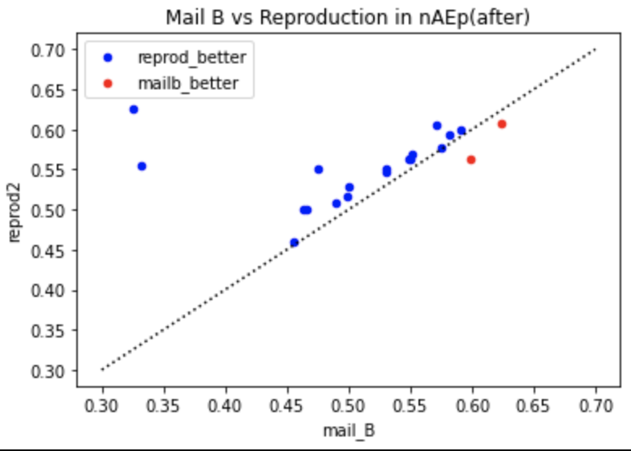
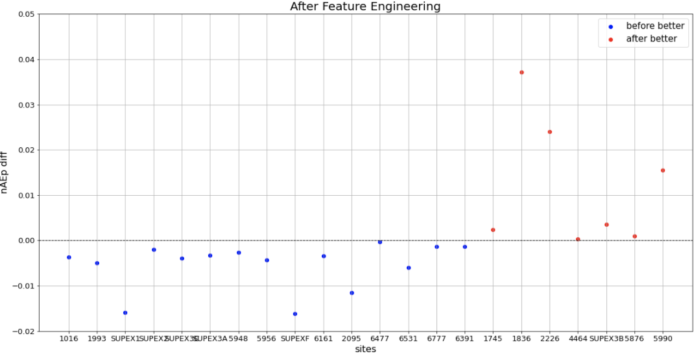

# Seaborn


### 참고

https://seaborn.pydata.org/index.html

https://datascienceschool.net/view-notebook/4c2d5ff1caab4b21a708cc662137bc65/


**seaborn에서 param 지정할 때 set 사용**

```python
sns.kdeplot(kpx_1836['nE_1836'], ax=axes[0][0]).set(xlim=(-0.75, 0.75), ylim=(0, 7), title=f'1836 nE range, std={std_1836:.2f}')
```


**pyplot**

https://matplotlib.org/stable/api/_as_gen/matplotlib.pyplot.plot.html - style options

```python
plt.figure(figsize=(20, 10))
plt.plot(df_13['prediction'], marker="o", label='13 prediction')
plt.plot(df_13['real'], marker="*", label='13 real')
plt.ylabel('Power Generation', fontsize=16)
plt.xlabel('Hour', fontsize=16)
plt.tick_params(labelsize=13)
plt.legend(fotsize=15)
plt.grid()
plt.title("2021-02-13", fontsize=20)
```


### ex1

```python
_, ax = plt.subplots()

result_df[result_df.reprod2 >= result_df.mail_B].plot.scatter(x="mail_B", y="reprod2", ax=ax, color="blue", label="reprod_better")
result_df[result_df.reprod2 < result_df.mail_B].plot.scatter(x="mail_B", y="reprod2", ax=ax, color="red", label="mailb_better")

ax.plot([0.3, 0.7], [0.3, 0.7], color="black", ls=':')
ax.set_title("Mail B vs Reproduction in nAEp(after)")
plt.show()
```



</br>

### ex2

```python
plt.figure(figsize=(20,10))
plt.scatter(result_df[result_df['diff'] <= 0].index, result_df[result_df['diff'] <= 0]['diff'], color='blue', label='before better', alpha=0.1)
plt.scatter(result_df[result_df['diff'] > 0].index, result_df[result_df['diff'] > 0]['diff'], color='red', label='after better', alpha=0.1)
plt.legend(fontsize=15)
plt.axhline(y=0, color='black', linestyle='--', lw=1)
plt.ylim(-0.02, 0.05)
plt.ylabel('nAEp diff', fontsize=16)
plt.xlabel('sites', fontsize=16)
plt.tick_params(labelsize=13)
plt.legend(fontsize=15)
plt.grid()
plt.title("After Feature Engineering", fontsize=20)
plt.show()
```



</br>

### subplots

```python
# 세로로
fit, axes = plt.subplots(2)
# 가로로
fig, axes = plt.subplots(1, 2)
fig.suptitle('Horizontally stacked subplots')
axes[0].plot(x, y)
axes[1].plot(x, -y)
```

